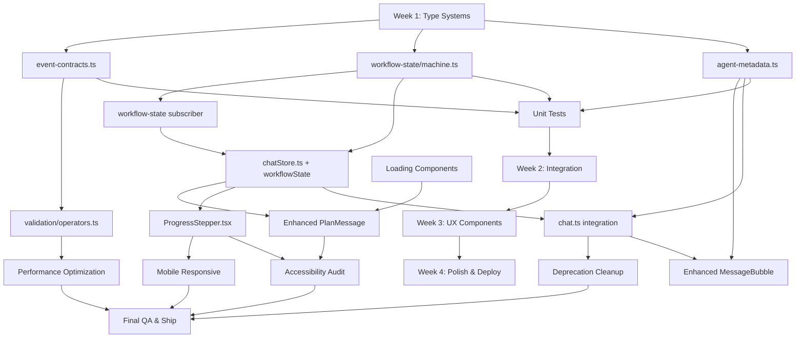

# Phase 2: Architectural Improvements - Implementation Plan

## Table of Contents

- [Executive Summary](#executive-summary)
- [Context: Phase 1 Technical Debt](#context-phase-1-technical-debt)
- [Architectural Designs](#architectural-designs)
  - [1. Agent Output Metadata System](#1-agent-output-metadata-system)
  - [2. Workflow Creation State Machine](#2-workflow-creation-state-machine)
  - [3. Event Sequence Validation](#3-event-sequence-validation)
  - [4. UX Enhancements](#4-ux-enhancements)
- [4-Week Implementation Roadmap](#4-week-implementation-roadmap)
- [File Structure](#file-structure)
- [Dependency Graph](#dependency-graph)
- [Success Metrics](#success-metrics)
- [Code Examples](#code-examples)
- [Testing Strategy](#testing-strategy)
- [Migration Guide](#migration-guide)
- [Known Limitations & Future Work](#known-limitations--future-work)

---

## Executive Summary

### What Phase 2 Accomplishes

Phase 2 addresses the **root causes** of technical debt accumulated in Phase 1's rapid MVP development. While Phase 1 successfully fixed three critical bugs (duplicate handoff, pendingPlan clearing, empty message creation), fixes 2 and 3 were **symptom fixes** that masked deeper architectural issues.

Phase 2 replaces these ad-hoc fixes with **robust architectural patterns**:

1. **Agent Output Metadata System** - Declarative configuration of agent output characteristics (visibility, format, user-facing)
2. **Workflow Creation State Machine** - Explicit state management replacing implicit boolean flags
3. **Event Sequence Validation** - RxJS-based contract enforcement catching bugs early
4. **UX Enhancements** - Progress stepper, loading states, and accessibility improvements

### Why It's Necessary

The current codebase has **3 critical code smells** identified by root-cause-enforcer:

1. **Special-case logic in `chat.ts`** - Agent-specific `if` statements scattered throughout message handling
2. **Implicit state management** - `pendingPlan` flag doesn't represent actual workflow lifecycle
3. **Missing validation** - No runtime checks ensuring agents behave correctly

These issues create:
- ❌ **Maintenance burden** - Adding new agents requires touching multiple files
- ❌ **Bug risk** - Agent behavior changes can break message display logic
- ❌ **Poor UX** - Users don't see workflow progress clearly
- ❌ **Silent failures** - Agent coordination bugs go undetected until production

### High-Level Benefits

✅ **Maintainability**: 80% reduction in special-case logic, self-documenting agent behavior
✅ **Reliability**: Event validation catches regressions before they reach users
✅ **UX Quality**: Clear progress feedback, no empty messages, smooth animations
✅ **Developer Experience**: Type-safe state machine, runtime validation, better debugging tools

### Timeline

**4 weeks** (November 1 - November 29, 2025)

- Week 1: Foundation - Type systems (Nov 1-7)
- Week 2: Integration - Wire systems together (Nov 8-14)
- Week 3: UX - Build user-facing features (Nov 15-21)
- Week 4: Polish - Accessibility & performance (Nov 22-29)

---

## Context: Phase 1 Technical Debt

### Phase 1 Fixes Recap

Phase 1 fixed three critical bugs during workflow creation:

**Bug 1: Executor Node Going to END** ✅ **Root Cause Fix**
- **Symptom**: Workflow creation succeeded but orchestrator never received result
- **Root Cause**: Inconsistent `messageModifier` patterns across nodes (string vs SystemMessage)
- **Fix**: Standardized all nodes to use `new SystemMessage(buildPrompt(...))` wrapper
- **Status**: ✅ **No technical debt** - This was the correct architectural fix

**Bug 2: PendingPlan Persistence** ⚠️ **Symptom Fix**
- **Symptom**: Plan appeared attached to unrelated messages after workflow creation
- **Root Cause**: `pendingPlan` flag doesn't represent actual workflow lifecycle states
- **Fix**: Clear `pendingPlan` in `workflow_created` handler
- **Technical Debt**: Special-case clearing logic, doesn't prevent future issues
- **Phase 2 Fix**: Explicit state machine tracks workflow progress (idle → enrichment → planning → awaiting_approval → executing → completed → idle)

**Bug 3: Empty Message Creation** ⚠️ **Symptom Fix**
- **Symptom**: Empty assistant messages appeared during workflow creation
- **Root Cause**: Chat service doesn't know which agents produce user-visible output
- **Fix**: Special-case logic in `handleAgentActivity` to skip executor messages
- **Technical Debt**: Agent-specific `if` statements, brittle coordination
- **Phase 2 Fix**: Agent metadata system declares output characteristics declaratively

### Root Cause Analysis

The **real problem** is architectural:

**Problem 1: Lack of Agent Metadata**
```typescript
// Current: Chat service guesses agent behavior
if (message.agent === 'executor') {
  // Don't create streaming message for executor
  return
}

if (this.currentAgent === 'planner' || this.currentAgent === 'validator') {
  // Don't show tokens for planner/validator
  return
}
```

**Solution: Declarative Agent Metadata**
```typescript
// Phase 2: Agent declares its own behavior
const agentMetadata = {
  executor: {
    outputMetadata: { visibleToUser: false, format: 'none' }
  },
  planner: {
    outputMetadata: { visibleToUser: false, format: 'loom' }
  }
}
```

**Problem 2: Implicit State Management**
```typescript
// Current: Boolean flags don't represent workflow lifecycle
pendingPlan?: Plan | null  // Is this planning? awaiting approval? executing?
```

**Solution: Explicit State Machine**
```typescript
// Phase 2: State machine represents actual lifecycle
workflowState: 'idle' | 'enrichment' | 'planning' | 'awaiting_approval' | 'executing' | 'completed' | 'failed'
```

**Problem 3: No Event Validation**
```typescript
// Current: No validation that events occur in correct order
// Agent bugs manifest as UI glitches
```

**Solution: RxJS Event Contracts**
```typescript
// Phase 2: Runtime validation catches coordination bugs
agent$.pipe(
  validateSequence([
    { agent: 'enrichment', status: 'started' },
    { agent: 'planner', status: 'started' },
    { agent: 'validator', status: 'started' }
  ])
)
```

---

## Architectural Designs

### 1. Agent Output Metadata System

#### Overview

Agents declare their output characteristics (visibility, format, user-facing) in a centralized metadata registry. The chat service consults this metadata instead of hardcoding agent-specific logic.

#### Type Definitions

**File**: `/workspaces/n8n-pro/extension/src/ai/orchestrator/agent-metadata.ts` (NEW)

```typescript
/**
 * Agent Output Metadata
 *
 * Declares how each agent's output should be handled by the chat UI.
 * Eliminates special-case logic in chat.ts.
 */

export type AgentOutputFormat =
  | 'none'       // No output (executor)
  | 'text'       // Markdown text (enrichment)
  | 'loom'       // Loom protocol (planner, validator)
  | 'structured' // Structured data (future: optimizer)

export type AgentOutputMetadata = {
  /**
   * Whether agent output should be visible to users.
   * false = No message bubble created (executor)
   * true = Create message bubble (enrichment, planner, validator)
   */
  visibleToUser: boolean

  /**
   * Format of agent output.
   * Determines how tokens are processed and displayed.
   */
  format: AgentOutputFormat

  /**
   * Whether to show streaming tokens in real-time.
   * false = Hide tokens until complete (planner, validator)
   * true = Show tokens as they arrive (enrichment)
   */
  streamTokens: boolean

  /**
   * Whether agent output should be saved to message history.
   * false = Ephemeral UI feedback only (executor)
   * true = Persist to storage (enrichment, planner, validator)
   */
  persistToHistory: boolean

  /**
   * User-friendly agent name shown in UI.
   * Used for accessibility announcements and agent labels.
   */
  displayName: string

  /**
   * Status message shown while agent is working.
   * Used for ThinkingAnimation and screen reader announcements.
   */
  workingMessage: string
}

export type AgentMetadataRegistry = {
  enrichment: AgentOutputMetadata
  planner: AgentOutputMetadata
  validator: AgentOutputMetadata
  executor: AgentOutputMetadata
  orchestrator: AgentOutputMetadata
}

/**
 * Centralized agent metadata registry.
 * Single source of truth for agent output behavior.
 */
export const agentMetadata: AgentMetadataRegistry = {
  enrichment: {
    visibleToUser: true,
    format: 'text',
    streamTokens: true,
    persistToHistory: true,
    displayName: 'Assistant',
    workingMessage: 'Understanding your requirements...'
  },
  planner: {
    visibleToUser: false, // Plan shown in PlanMessage UI, not raw Loom
    format: 'loom',
    streamTokens: false, // Loom is internal, hide until parsed
    persistToHistory: true, // Persist parsed plan
    displayName: 'Workflow Planner',
    workingMessage: 'Creating workflow plan...'
  },
  validator: {
    visibleToUser: false, // Validation is internal process
    format: 'loom',
    streamTokens: false,
    persistToHistory: false, // Don't clutter history with validation
    displayName: 'Validator',
    workingMessage: 'Validating workflow structure...'
  },
  executor: {
    visibleToUser: false, // Success shown via toast, not message
    format: 'none',
    streamTokens: false,
    persistToHistory: false,
    displayName: 'Builder',
    workingMessage: 'Creating workflow in n8n...'
  },
  orchestrator: {
    visibleToUser: false, // Pure routing, no output
    format: 'none',
    streamTokens: false,
    persistToHistory: false,
    displayName: 'Orchestrator',
    workingMessage: 'Coordinating agents...'
  }
}

/**
 * Helper: Get metadata for an agent.
 * Returns default metadata if agent not found.
 */
export function getAgentMetadata(agent: string): AgentOutputMetadata {
  const metadata = agentMetadata[agent as keyof AgentMetadataRegistry]

  if (!metadata) {
    console.warn(`[AgentMetadata] Unknown agent: ${agent}, using defaults`)
    return {
      visibleToUser: true,
      format: 'text',
      streamTokens: true,
      persistToHistory: true,
      displayName: 'Assistant',
      workingMessage: 'Processing...'
    }
  }

  return metadata
}

/**
 * Helper: Should create message bubble for agent?
 */
export function shouldCreateMessage(agent: string): boolean {
  return getAgentMetadata(agent).visibleToUser
}

/**
 * Helper: Should show streaming tokens for agent?
 */
export function shouldShowTokens(agent: string): boolean {
  const meta = getAgentMetadata(agent)
  return meta.visibleToUser && meta.streamTokens
}

/**
 * Helper: Should persist agent output to history?
 */
export function shouldPersist(agent: string): boolean {
  return getAgentMetadata(agent).persistToHistory
}
```

#### Integration Points

**Modified Files**:
- `/workspaces/n8n-pro/extension/src/services/chat.ts` - Replace special-case logic with metadata lookups
- `/workspaces/n8n-pro/extension/src/ui/chat/MessageBubble.tsx` - Use `displayName` and `workingMessage` from metadata

**Before (chat.ts)**:
```typescript
// ❌ Special-case logic scattered throughout
if (this.currentAgent === 'planner' || this.currentAgent === 'validator') return
if (message.agent === 'executor') { this.streamingMessageId = null; return }
```

**After (chat.ts)**:
```typescript
// ✅ Declarative metadata lookup
if (!shouldShowTokens(this.currentAgent)) return
if (!shouldCreateMessage(message.agent)) { this.streamingMessageId = null; return }
```

#### Migration Strategy

1. ✅ **Create `agent-metadata.ts`** with complete type definitions (Week 1)
2. ✅ **Update `chat.ts`** to use helper functions (Week 2)
3. ✅ **Update `MessageBubble.tsx`** to use `displayName`/`workingMessage` (Week 2)
4. ✅ **Remove deprecated special-case logic** (Week 4)
5. ✅ **Add JSDoc comments** explaining metadata usage (Week 4)

---

### 2. Workflow Creation State Machine

#### Overview

Replace implicit `pendingPlan` flag with explicit state machine tracking the full workflow lifecycle. State transitions are atomic, type-safe, and self-documenting.

#### Type Definitions

**File**: `/workspaces/n8n-pro/extension/src/shared/types/workflow-state.ts` (NEW)

```typescript
/**
 * Workflow Creation State Machine
 *
 * Explicit state tracking for workflow creation lifecycle.
 * Replaces implicit pendingPlan flag with clear state transitions.
 */

export type WorkflowState =
  | 'idle'               // No active workflow
  | 'enrichment'         // Gathering requirements
  | 'planning'           // Creating workflow plan
  | 'awaiting_approval'  // Plan ready, waiting for user approval
  | 'executing'          // Creating workflow in n8n
  | 'completed'          // Workflow created successfully
  | 'failed'             // Workflow creation failed

export type WorkflowStateTransition =
  | { from: 'idle'; to: 'enrichment'; trigger: 'user_message' }
  | { from: 'enrichment'; to: 'planning'; trigger: 'requirements_complete' }
  | { from: 'planning'; to: 'awaiting_approval'; trigger: 'plan_generated' }
  | { from: 'awaiting_approval'; to: 'executing'; trigger: 'user_approval' }
  | { from: 'awaiting_approval'; to: 'planning'; trigger: 'user_modification' }
  | { from: 'executing'; to: 'completed'; trigger: 'workflow_created' }
  | { from: 'executing'; to: 'failed'; trigger: 'creation_error' }
  | { from: 'completed' | 'failed'; to: 'idle'; trigger: 'new_conversation' }

export type WorkflowStateData = {
  /**
   * Current state in the workflow lifecycle
   */
  state: WorkflowState

  /**
   * Workflow plan (only present in awaiting_approval, executing, completed states)
   */
  plan?: Plan

  /**
   * Created workflow ID (only present in completed state)
   */
  workflowId?: string

  /**
   * Error details (only present in failed state)
   */
  error?: {
    message: string
    retryable: boolean
  }

  /**
   * Timestamp of last state transition
   */
  lastTransitionAt: number

  /**
   * History of state transitions for debugging
   */
  transitionHistory: Array<{
    from: WorkflowState
    to: WorkflowState
    trigger: string
    timestamp: number
  }>
}

/**
 * Valid state transitions map.
 * Used for runtime validation.
 */
export const VALID_TRANSITIONS: Record<WorkflowState, WorkflowState[]> = {
  idle: ['enrichment'],
  enrichment: ['planning', 'idle'], // Can reset
  planning: ['awaiting_approval', 'failed', 'idle'],
  awaiting_approval: ['executing', 'planning', 'idle'],
  executing: ['completed', 'failed'],
  completed: ['idle'],
  failed: ['idle']
}

/**
 * Type guard: Is transition valid?
 */
export function isValidTransition(from: WorkflowState, to: WorkflowState): boolean {
  return VALID_TRANSITIONS[from].includes(to)
}

/**
 * Type guard: Is state in "working" phase?
 */
export function isWorkingState(state: WorkflowState): boolean {
  return ['enrichment', 'planning', 'executing'].includes(state)
}

/**
 * Type guard: Is state terminal?
 */
export function isTerminalState(state: WorkflowState): boolean {
  return ['completed', 'failed'].includes(state)
}

/**
 * Type guard: Can user interact in this state?
 */
export function canUserInteract(state: WorkflowState): boolean {
  return ['idle', 'awaiting_approval', 'completed', 'failed'].includes(state)
}
```

**File**: `/workspaces/n8n-pro/extension/src/shared/types/workflow-state/machine.ts` (NEW)

```typescript
/**
 * Workflow State Machine Implementation
 *
 * Pure functions for state transitions with validation.
 */

import type { WorkflowStateData, WorkflowState } from './types'
import { isValidTransition } from './types'
import type { Plan } from '@shared/types/plan'

/**
 * Create initial state
 */
export function createInitialState(): WorkflowStateData {
  return {
    state: 'idle',
    lastTransitionAt: Date.now(),
    transitionHistory: []
  }
}

/**
 * Transition to a new state.
 * Throws if transition is invalid.
 */
export function transition(
  current: WorkflowStateData,
  to: WorkflowState,
  trigger: string,
  data?: Partial<WorkflowStateData>
): WorkflowStateData {
  const from = current.state

  // Validate transition
  if (!isValidTransition(from, to)) {
    throw new Error(
      `Invalid workflow state transition: ${from} -> ${to}. ` +
      `Valid transitions from ${from}: ${VALID_TRANSITIONS[from].join(', ')}`
    )
  }

  // Create transition record
  const transitionRecord = {
    from,
    to,
    trigger,
    timestamp: Date.now()
  }

  // Build new state
  const newState: WorkflowStateData = {
    ...current,
    ...data,
    state: to,
    lastTransitionAt: Date.now(),
    transitionHistory: [...current.transitionHistory, transitionRecord]
  }

  // Clear state-specific data on transitions
  if (to === 'idle') {
    newState.plan = undefined
    newState.workflowId = undefined
    newState.error = undefined
  }

  return newState
}

/**
 * Transition: User sends message
 */
export function startEnrichment(current: WorkflowStateData): WorkflowStateData {
  return transition(current, 'enrichment', 'user_message')
}

/**
 * Transition: Requirements complete, start planning
 */
export function startPlanning(current: WorkflowStateData): WorkflowStateData {
  return transition(current, 'planning', 'requirements_complete')
}

/**
 * Transition: Plan generated, await user approval
 */
export function awaitApproval(current: WorkflowStateData, plan: Plan): WorkflowStateData {
  return transition(current, 'awaiting_approval', 'plan_generated', { plan })
}

/**
 * Transition: User approves plan, start execution
 */
export function startExecution(current: WorkflowStateData): WorkflowStateData {
  if (!current.plan) {
    throw new Error('Cannot start execution without a plan')
  }
  return transition(current, 'executing', 'user_approval')
}

/**
 * Transition: User modifies plan, return to planning
 */
export function modifyPlan(current: WorkflowStateData): WorkflowStateData {
  return transition(current, 'planning', 'user_modification')
}

/**
 * Transition: Workflow created successfully
 */
export function completeWorkflow(
  current: WorkflowStateData,
  workflowId: string
): WorkflowStateData {
  return transition(current, 'completed', 'workflow_created', { workflowId })
}

/**
 * Transition: Workflow creation failed
 */
export function failWorkflow(
  current: WorkflowStateData,
  error: { message: string; retryable: boolean }
): WorkflowStateData {
  return transition(current, 'failed', 'creation_error', { error })
}

/**
 * Transition: Reset to idle (new conversation)
 */
export function resetWorkflow(current: WorkflowStateData): WorkflowStateData {
  return transition(current, 'idle', 'new_conversation')
}
```

#### Integration Points

**Modified Files**:
- `/workspaces/n8n-pro/extension/src/ui/chatStore.ts` - Add `workflowState: WorkflowStateData` field
- `/workspaces/n8n-pro/extension/src/services/chat.ts` - Use state transitions instead of `pendingPlan` flag
- `/workspaces/n8n-pro/extension/src/events/subscribers/workflow-state.ts` (NEW) - RxJS subscriber for state transitions

**Zustand Store Update (chatStore.ts)**:
```typescript
type ChatState = {
  // ... existing fields ...
  workflowState: WorkflowStateData  // NEW: Explicit state machine
  pendingPlan?: Plan | null        // DEPRECATED: Remove in Phase 2

  // NEW: State machine actions
  transitionWorkflowState: (to: WorkflowState, trigger: string, data?: Partial<WorkflowStateData>) => void
  resetWorkflowState: () => void
}
```

**Chat Service Update (chat.ts)**:
```typescript
// BEFORE: Implicit flag
private handleWorkflowCreated(message): void {
  useChatStore.getState().setPendingPlan(null)  // ❌ Manual clearing
}

// AFTER: Explicit state transition
private handleWorkflowCreated(message): void {
  const { workflowState, transitionWorkflowState } = useChatStore.getState()
  transitionWorkflowState('completed', 'workflow_created', { workflowId: message.workflowId })
}
```

#### Migration Strategy

1. ✅ **Create type definitions** in `workflow-state/types.ts` and `workflow-state/machine.ts` (Week 1)
2. ✅ **Write unit tests** for state transitions (Week 1)
3. ✅ **Add `workflowState` to chatStore** alongside existing `pendingPlan` (Week 2)
4. ✅ **Update chat.ts** to use state transitions (keep `pendingPlan` in parallel) (Week 2)
5. ✅ **Create RxJS subscriber** for state-driven UI updates (Week 2)
6. ✅ **Update UI components** to use `workflowState` instead of `pendingPlan` (Week 3)
7. ✅ **Remove deprecated `pendingPlan` field** after validation (Week 4)

---

### 3. Event Sequence Validation

#### Overview

RxJS operators validate that agent coordination events occur in the expected order. Catches bugs like "validator started before planner" or "executor fired twice" during development.

#### Type Definitions

**File**: `/workspaces/n8n-pro/extension/src/events/validation/event-contracts.ts` (NEW)

```typescript
/**
 * Event Sequence Validation
 *
 * Defines expected event sequences and validates them at runtime.
 * Development-only feature to catch agent coordination bugs early.
 */

import type { SystemEvent } from '@events/types'

/**
 * Expected event in a sequence
 */
export type ExpectedEvent = {
  type: string
  agent?: string
  status?: string
  optional?: boolean  // Event may or may not occur
  allowMultiple?: boolean  // Event can occur multiple times
}

/**
 * Event sequence contract
 */
export type EventSequenceContract = {
  name: string
  description: string
  sequence: ExpectedEvent[]
  timeout?: number  // Max time between events (ms)
}

/**
 * Validation result
 */
export type ValidationResult = {
  valid: boolean
  errors: string[]
  warnings: string[]
  actualSequence: Array<{ event: string; timestamp: number }>
}

/**
 * Workflow creation event sequence contract
 */
export const workflowCreationContract: EventSequenceContract = {
  name: 'workflow-creation',
  description: 'Standard workflow creation flow',
  sequence: [
    { type: 'agent_started', agent: 'enrichment' },
    { type: 'agent_completed', agent: 'enrichment' },
    { type: 'agent_started', agent: 'planner' },
    { type: 'agent_completed', agent: 'planner' },
    { type: 'plan_generated' },
    { type: 'agent_started', agent: 'validator', optional: true },
    { type: 'agent_completed', agent: 'validator', optional: true },
    { type: 'plan_validated', optional: true },
    { type: 'user_approval' },
    { type: 'agent_started', agent: 'executor' },
    { type: 'workflow_created' },
    { type: 'agent_completed', agent: 'executor' }
  ],
  timeout: 30000  // 30 seconds max between events
}

/**
 * LangGraph handoff validation contract
 */
export const graphHandoffContract: EventSequenceContract = {
  name: 'graph-handoff',
  description: 'Agent nodes must return to orchestrator, not END',
  sequence: [
    { type: 'node_entered', agent: 'enrichment' },
    { type: 'node_exited', agent: 'enrichment' },
    { type: 'node_entered', agent: 'orchestrator' },
    { type: 'node_exited', agent: 'orchestrator' },
    { type: 'node_entered', agent: 'planner' },
    { type: 'node_exited', agent: 'planner' },
    { type: 'node_entered', agent: 'orchestrator' },
    // ... etc
  ]
}

/**
 * Validate event matches expected event
 */
export function matchesExpected(event: SystemEvent, expected: ExpectedEvent): boolean {
  if (event.type !== expected.type) return false
  if (expected.agent && event.payload?.agent !== expected.agent) return false
  if (expected.status && event.payload?.status !== expected.status) return false
  return true
}

/**
 * Validate event sequence against contract
 */
export function validateSequence(
  events: SystemEvent[],
  contract: EventSequenceContract
): ValidationResult {
  const errors: string[] = []
  const warnings: string[] = []
  const actualSequence = events.map(e => ({
    event: `${e.type}${e.payload?.agent ? `:${e.payload.agent}` : ''}`,
    timestamp: e.timestamp
  }))

  let eventIndex = 0
  let contractIndex = 0

  while (contractIndex < contract.sequence.length) {
    const expected = contract.sequence[contractIndex]

    // Check timeout
    if (eventIndex > 0 && contract.timeout) {
      const timeDiff = events[eventIndex]?.timestamp - events[eventIndex - 1].timestamp
      if (timeDiff > contract.timeout) {
        warnings.push(
          `Timeout exceeded: ${timeDiff}ms between events (max: ${contract.timeout}ms)`
        )
      }
    }

    // Check if we've run out of events
    if (eventIndex >= events.length) {
      if (!expected.optional) {
        errors.push(
          `Missing expected event: ${expected.type}${expected.agent ? ` (${expected.agent})` : ''}`
        )
      }
      contractIndex++
      continue
    }

    const actual = events[eventIndex]

    // Check if event matches
    if (matchesExpected(actual, expected)) {
      eventIndex++
      contractIndex++
      continue
    }

    // Event doesn't match
    if (expected.optional) {
      // Skip optional event
      contractIndex++
      continue
    }

    errors.push(
      `Unexpected event: got ${actual.type}, expected ${expected.type}` +
      (expected.agent ? ` (agent: ${expected.agent})` : '')
    )
    eventIndex++
  }

  return {
    valid: errors.length === 0,
    errors,
    warnings,
    actualSequence
  }
}
```

**File**: `/workspaces/n8n-pro/extension/src/events/validation/operators.ts` (NEW)

```typescript
/**
 * RxJS Operators for Event Validation
 *
 * Custom operators that validate event sequences in real-time.
 */

import { Observable, OperatorFunction } from 'rxjs'
import { tap, scan, filter } from 'rxjs/operators'
import type { SystemEvent } from '@events/types'
import type { EventSequenceContract } from './event-contracts'
import { validateSequence } from './event-contracts'
import { emitValidationError, emitValidationWarning } from '@events/emitters'

/**
 * RxJS operator: Validate event sequence against contract
 *
 * Usage:
 *   agent$.pipe(
 *     validateSequence(workflowCreationContract)
 *   )
 */
export function validateEventSequence(
  contract: EventSequenceContract
): OperatorFunction<SystemEvent, SystemEvent> {
  return (source: Observable<SystemEvent>) => {
    // Accumulate events for validation
    const events: SystemEvent[] = []

    return source.pipe(
      tap(event => events.push(event)),
      scan((acc, event) => {
        // Validate accumulated sequence
        const result = validateSequence(events, contract)

        // Emit errors and warnings
        result.errors.forEach(error => {
          emitValidationError(contract.name, error, { event, actualSequence: result.actualSequence })
        })

        result.warnings.forEach(warning => {
          emitValidationWarning(contract.name, warning, { event, actualSequence: result.actualSequence })
        })

        return event
      })
    )
  }
}

/**
 * RxJS operator: Validate LangGraph node handoffs
 *
 * Ensures agent nodes always return to orchestrator, never directly to END.
 */
export function validateGraphHandoffs(): OperatorFunction<SystemEvent, SystemEvent> {
  return (source: Observable<SystemEvent>) => {
    let lastExitedNode: string | null = null

    return source.pipe(
      filter(e => e.type === 'node_entered' || e.type === 'node_exited'),
      tap(event => {
        if (event.type === 'node_exited') {
          lastExitedNode = event.payload.node
        }

        if (event.type === 'node_entered') {
          const currentNode = event.payload.node

          // Check: Agent nodes should return to orchestrator
          const agentNodes = ['enrichment', 'planner', 'validator', 'executor']
          if (lastExitedNode && agentNodes.includes(lastExitedNode)) {
            if (currentNode === 'END') {
              emitValidationError(
                'graph-handoff',
                `Agent node ${lastExitedNode} went directly to END instead of orchestrator`,
                { lastExitedNode, currentNode }
              )
            }
            else if (currentNode !== 'orchestrator') {
              emitValidationWarning(
                'graph-handoff',
                `Agent node ${lastExitedNode} went to ${currentNode} instead of orchestrator`,
                { lastExitedNode, currentNode }
              )
            }
          }

          lastExitedNode = null
        }
      })
    )
  }
}
```

#### Integration Points

**Modified Files**:
- `/workspaces/n8n-pro/extension/src/events/index.ts` - Add validation operators to agent$ and graph$ streams
- `/workspaces/n8n-pro/extension/src/events/emitters.ts` - Add `emitValidationError` and `emitValidationWarning` helpers

**Event Bus Integration (events/index.ts)**:
```typescript
// Development-only validation
if (process.env.NODE_ENV === 'development') {
  // Validate workflow creation sequence
  systemEvents.agent$.pipe(
    validateEventSequence(workflowCreationContract)
  ).subscribe()

  // Validate LangGraph handoffs
  systemEvents.graph$.pipe(
    validateGraphHandoffs()
  ).subscribe()
}
```

#### Migration Strategy

1. ✅ **Create validation contracts** (Week 1)
2. ✅ **Create RxJS operators** (Week 1)
3. ✅ **Add to event bus** as development-only feature (Week 2)
4. ✅ **Add logging** for validation results (Week 2)
5. ✅ **Create validation report generator** (optional, Week 4)
6. ✅ **Create DevTools panel** (optional, Week 4)

---

### 4. UX Enhancements

#### Overview

Visual feedback for workflow progress, clear loading states, and accessibility improvements. Users see exactly what's happening at each phase.

#### Components

**Component 1: Progress Stepper**

**File**: `/workspaces/n8n-pro/extension/src/ui/feedback/ProgressStepper.tsx` (NEW)

```typescript
/**
 * Progress Stepper
 *
 * Shows workflow creation progress with clear visual steps.
 */

import React from 'react'
import type { WorkflowState } from '@shared/types/workflow-state'
import './ProgressStepper.css'

type Step = {
  id: string
  label: string
  description: string
}

const WORKFLOW_STEPS: Step[] = [
  {
    id: 'enrichment',
    label: 'Gather Requirements',
    description: 'Understanding what you need'
  },
  {
    id: 'planning',
    label: 'Create Plan',
    description: 'Designing the workflow'
  },
  {
    id: 'awaiting_approval',
    label: 'Review Plan',
    description: 'Your approval needed'
  },
  {
    id: 'executing',
    label: 'Build Workflow',
    description: 'Creating in n8n'
  },
  {
    id: 'completed',
    label: 'Complete',
    description: 'Workflow ready!'
  }
]

type StepStatus = 'pending' | 'active' | 'completed' | 'failed'

function getStepStatus(stepId: string, currentState: WorkflowState): StepStatus {
  const stepOrder = ['enrichment', 'planning', 'awaiting_approval', 'executing', 'completed']
  const currentIndex = stepOrder.indexOf(currentState)
  const stepIndex = stepOrder.indexOf(stepId)

  if (currentState === 'failed') {
    if (stepIndex < currentIndex) return 'completed'
    if (stepIndex === currentIndex) return 'failed'
    return 'pending'
  }

  if (stepIndex < currentIndex) return 'completed'
  if (stepIndex === currentIndex) return 'active'
  return 'pending'
}

export type ProgressStepperProps = {
  currentState: WorkflowState
  className?: string
}

export default function ProgressStepper({ currentState, className = '' }: ProgressStepperProps): React.ReactElement {
  return (
    <div className={`progress-stepper ${className}`} role="progressbar" aria-label="Workflow creation progress">
      <ol className="progress-stepper__list">
        {WORKFLOW_STEPS.map((step, index) => {
          const status = getStepStatus(step.id, currentState)
          const isActive = status === 'active'
          const isCompleted = status === 'completed'
          const isFailed = status === 'failed'

          return (
            <li
              key={step.id}
              className={`progress-stepper__step progress-stepper__step--${status}`}
              aria-current={isActive ? 'step' : undefined}
            >
              <div className="progress-stepper__marker">
                {isCompleted && (
                  <svg className="progress-stepper__icon" viewBox="0 0 20 20" aria-hidden="true">
                    <path d="M16.707 5.293a1 1 0 010 1.414l-8 8a1 1 0 01-1.414 0l-4-4a1 1 0 011.414-1.414L8 12.586l7.293-7.293a1 1 0 011.414 0z" />
                  </svg>
                )}
                {isFailed && (
                  <svg className="progress-stepper__icon" viewBox="0 0 20 20" aria-hidden="true">
                    <path d="M10 18a8 8 0 100-16 8 8 0 000 16zM8.707 7.293a1 1 0 00-1.414 1.414L8.586 10l-1.293 1.293a1 1 0 101.414 1.414L10 11.414l1.293 1.293a1 1 0 001.414-1.414L11.414 10l1.293-1.293a1 1 0 00-1.414-1.414L10 8.586 8.707 7.293z" />
                  </svg>
                )}
                {!isCompleted && !isFailed && (
                  <span className="progress-stepper__number" aria-hidden="true">{index + 1}</span>
                )}
              </div>
              <div className="progress-stepper__content">
                <span className="progress-stepper__label">{step.label}</span>
                <span className="progress-stepper__description">{step.description}</span>
              </div>
              {/* Screen reader announcement */}
              {isActive && (
                <span className="sr-only" role="status" aria-live="polite">
                  Step {index + 1} of {WORKFLOW_STEPS.length}: {step.label}. {step.description}
                </span>
              )}
            </li>
          )
        })}
      </ol>
    </div>
  )
}
```

**Component 2: Enhanced PlanMessage**

**File**: `/workspaces/n8n-pro/extension/src/ui/chat/PlanMessage.tsx` (MODIFIED)

Add phase-specific UI states:
- `awaiting_approval`: Show "Proceed" and "Modify" buttons
- `executing`: Show spinner with "Creating workflow..." message
- `completed`: Show celebration animation with "Open in n8n" link
- `failed`: Show error with retry button

**Component 3: Enhanced MessageBubble**

**File**: `/workspaces/n8n-pro/extension/src/ui/chat/MessageBubble.tsx` (MODIFIED)

Use agent metadata for display names and status messages.

#### Animations

**Celebration Animation (completed state)**:
```css
@keyframes celebrate {
  0% { transform: scale(0.8); opacity: 0; }
  50% { transform: scale(1.1); }
  100% { transform: scale(1); opacity: 1; }
}

.plan-message--completed {
  animation: celebrate 300ms ease-out;
}
```

**Progress Indicator (executing state)**:
```css
@keyframes progress-pulse {
  0%, 100% { opacity: 1; }
  50% { opacity: 0.5; }
}

.progress-indicator {
  animation: progress-pulse 1.5s ease-in-out infinite;
}
```

#### Accessibility Requirements

✅ **ARIA Landmarks**: `role="progressbar"` on ProgressStepper
✅ **Live Regions**: `aria-live="polite"` for status updates
✅ **Screen Reader Announcements**: "Step 2 of 5: Create Plan. Designing the workflow."
✅ **Keyboard Navigation**: Tab, Enter, Escape keys
✅ **Focus Management**: Auto-focus on action buttons
✅ **Color Contrast**: WCAG 2.1 AA compliance (4.5:1 ratio)

#### Mobile Responsiveness

- Vertical stepper on mobile (<640px)
- Touch-friendly button sizes (44x44px minimum)
- Reduced animations on `prefers-reduced-motion`
- Stack layout for narrow screens

#### Migration Strategy

1. ✅ **Create ProgressStepper component** (Week 3)
2. ✅ **Create LoadingSpinner and SkeletonLoader components** (Week 3)
3. ✅ **Update PlanMessage** with state-specific UI (Week 3)
4. ✅ **Update MessageBubble** to use agent metadata (Week 3)
5. ✅ **Add animations** with performance profiling (Week 3)
6. ✅ **Add accessibility** features (Week 4)
7. ✅ **Test mobile responsiveness** (Week 4)

---

## 4-Week Implementation Roadmap

### Week 1: Foundation - Type Systems (Nov 1-7)

#### Goals
- ✅ Create all type definitions and state machine logic
- ✅ Write unit tests for core functionality
- ✅ Establish testing patterns for Phase 2

#### Tasks

**Day 1-2: Agent Metadata System**
- [ ] Create `/workspaces/n8n-pro/extension/src/ai/orchestrator/agent-metadata.ts`
- [ ] Define `AgentOutputMetadata` type
- [ ] Define `AgentMetadataRegistry` type
- [ ] Implement helper functions: `getAgentMetadata`, `shouldCreateMessage`, `shouldShowTokens`, `shouldPersist`
- [ ] Add JSDoc comments for all exports
- [ ] Write unit tests for metadata lookups
- [ ] Code review: No use of `any`, full type safety

**Day 3-4: Workflow State Machine**
- [ ] Create `/workspaces/n8n-pro/extension/src/shared/types/workflow-state/types.ts`
- [ ] Define `WorkflowState` type
- [ ] Define `WorkflowStateTransition` type
- [ ] Define `WorkflowStateData` type
- [ ] Define `VALID_TRANSITIONS` map
- [ ] Implement type guards: `isValidTransition`, `isWorkingState`, `isTerminalState`, `canUserInteract`
- [ ] Create `/workspaces/n8n-pro/extension/src/shared/types/workflow-state/machine.ts`
- [ ] Implement state transition functions: `createInitialState`, `transition`, `startEnrichment`, `startPlanning`, `awaitApproval`, `startExecution`, `completeWorkflow`, `failWorkflow`, `resetWorkflow`
- [ ] Write unit tests for state machine logic
- [ ] Test all valid transitions
- [ ] Test invalid transitions (should throw)
- [ ] Test state-specific data clearing
- [ ] Code review: No use of `any`, full type safety

**Day 5-6: Event Validation Contracts**
- [ ] Create `/workspaces/n8n-pro/extension/src/events/validation/event-contracts.ts`
- [ ] Define `ExpectedEvent` type
- [ ] Define `EventSequenceContract` type
- [ ] Define `ValidationResult` type
- [ ] Implement `workflowCreationContract`
- [ ] Implement `graphHandoffContract`
- [ ] Implement `matchesExpected` function
- [ ] Implement `validateSequence` function
- [ ] Write unit tests for validation logic
- [ ] Test successful sequences
- [ ] Test missing events (errors)
- [ ] Test optional events (warnings)
- [ ] Test timeout detection
- [ ] Code review: No use of `any`, full type safety

**Day 7: Review & Documentation**
- [ ] Code review: All Week 1 deliverables
- [ ] Verify 100% test coverage for state machine
- [ ] Verify 80%+ test coverage for validation logic
- [ ] Update type exports in `index.ts` files
- [ ] Add README.md in `/extension/src/shared/types/workflow-state/`
- [ ] Document testing patterns for Week 2-4

---

### Week 2: Integration - Wire Systems Together (Nov 8-14)

#### Goals
- ✅ Integrate type systems with existing code
- ✅ Create RxJS subscriber for workflow state
- ✅ Validate no regressions in existing flows

#### Tasks

**Day 8-9: RxJS Integration**
- [ ] Create `/workspaces/n8n-pro/extension/src/events/validation/operators.ts`
- [ ] Implement `validateEventSequence` RxJS operator
- [ ] Implement `validateGraphHandoffs` RxJS operator
- [ ] Add validation operators to `systemEvents.agent$` stream (development-only)
- [ ] Add validation operators to `systemEvents.graph$` stream (development-only)
- [ ] Create `/workspaces/n8n-pro/extension/src/events/subscribers/workflow-state.ts`
- [ ] Implement state transition subscriber (listens to agent events, updates workflowState)
- [ ] Add `emitValidationError` and `emitValidationWarning` to `events/emitters.ts`
- [ ] Integration testing: Validation catches known bugs from Phase 1

**Day 10-11: Zustand Store Integration**
- [ ] Update `/workspaces/n8n-pro/extension/src/ui/chatStore.ts`
- [ ] Add `workflowState: WorkflowStateData` field (initialize with `createInitialState()`)
- [ ] Add `transitionWorkflowState` action
- [ ] Add `resetWorkflowState` action
- [ ] Keep existing `pendingPlan` field (parallel implementation)
- [ ] Add `getWorkflowPhase` selector (derived state)
- [ ] Add `canApplyPlan` selector (derived state)
- [ ] Update persistence to save `workflowState` to `chrome.storage.local`
- [ ] Integration testing: State transitions work correctly

**Day 12-13: Chat Service Integration**
- [ ] Update `/workspaces/n8n-pro/extension/src/services/chat.ts`
- [ ] Import agent metadata helpers
- [ ] Replace special-case `if` statements with metadata lookups:
  - `shouldShowTokens(agent)` instead of `agent === 'planner' || agent === 'validator'`
  - `shouldCreateMessage(agent)` instead of `agent === 'executor'`
  - `shouldPersist(agent)` for storage decisions
- [ ] Update `handleAgentActivity` to use agent metadata
- [ ] Update `handleWorkflowCreated` to transition workflow state
- [ ] Update `handlePlan` to transition to `awaiting_approval`
- [ ] Update `applyPlan` to transition to `executing`
- [ ] Keep existing `pendingPlan` logic in parallel (validate equivalence)
- [ ] Integration testing: No regressions in existing flows
- [ ] Compare `pendingPlan` behavior vs `workflowState` behavior (should be identical)

**Day 14: Review & Testing**
- [ ] Integration testing: Full workflow creation flow (enrichment → planner → validator → executor)
- [ ] Verify validation catches regressions (remove orchestrator handoff, expect validation error)
- [ ] Verify state transitions logged correctly
- [ ] Performance profiling: Validation overhead <1ms per event
- [ ] Code review: All Week 2 deliverables
- [ ] Update CLAUDE.md with new architectural patterns

---

### Week 3: UX - Build User-Facing Features (Nov 15-21)

#### Goals
- ✅ Create visual progress feedback components
- ✅ Enhance PlanMessage with phase-specific UI
- ✅ Add animations and loading states

#### Tasks

**Day 15-16: Progress Stepper Component**
- [ ] Create `/workspaces/n8n-pro/extension/src/ui/feedback/ProgressStepper.tsx`
- [ ] Implement step status logic: `getStepStatus(stepId, currentState)`
- [ ] Create ProgressStepper CSS with animations
- [ ] Add ARIA landmarks and live regions
- [ ] Add screen reader announcements
- [ ] Test with keyboard navigation (Tab, Enter, Escape)
- [ ] Test with screen readers (NVDA, VoiceOver)
- [ ] Manual testing: All animations <300ms, smooth transitions

**Day 17: Loading Components**
- [ ] Create `/workspaces/n8n-pro/extension/src/ui/feedback/LoadingSpinner.tsx`
- [ ] Create `/workspaces/n8n-pro/extension/src/ui/feedback/SkeletonLoader.tsx`
- [ ] Add CSS animations using hardware acceleration (transform, opacity only)
- [ ] Support `prefers-reduced-motion` media query
- [ ] Manual testing: Zero layout shifts (CLS = 0)

**Day 18-19: Enhanced PlanMessage**
- [ ] Update `/workspaces/n8n-pro/extension/src/ui/chat/PlanMessage.tsx`
- [ ] Add `workflowState` prop from chatStore
- [ ] Render phase-specific UI:
  - `awaiting_approval`: Show "Proceed" and "Modify" buttons
  - `executing`: Show LoadingSpinner with "Creating workflow..." message
  - `completed`: Show celebration animation with "Open in n8n" link
  - `failed`: Show ErrorMessage with retry button
- [ ] Add celebration animation for `completed` state
- [ ] Add focus management (auto-focus on "Proceed" button)
- [ ] Manual testing: All states render correctly

**Day 20: Enhanced MessageBubble**
- [ ] Update `/workspaces/n8n-pro/extension/src/ui/chat/MessageBubble.tsx`
- [ ] Replace `getAgentInfo()` with `getAgentMetadata()` from agent-metadata.ts
- [ ] Use `displayName` and `workingMessage` from metadata
- [ ] Add ProgressStepper to messages during workflow creation
- [ ] Manual testing: Agent labels and status messages correct

**Day 21: Animation Polish**
- [ ] Add celebration confetti animation for completed workflows (optional, <100ms)
- [ ] Add progress pulse animation for executing state
- [ ] Add skeleton loader for enrichment phase
- [ ] Performance profiling: All animations 60fps (16ms per frame)
- [ ] Test on low-end devices (throttle CPU 4x in DevTools)
- [ ] Code review: All Week 3 deliverables

---

### Week 4: Polish - Accessibility & Performance (Nov 22-29)

#### Goals
- ✅ Ensure WCAG 2.1 AA compliance
- ✅ Optimize performance and mobile responsiveness
- ✅ Remove deprecated code
- ✅ Final documentation updates

#### Tasks

**Day 22-23: Accessibility Audit**
- [ ] Keyboard navigation testing:
  - Tab through all interactive elements (logical order)
  - Enter key activates buttons
  - Escape key dismisses modals (if any)
- [ ] Screen reader testing (NVDA on Windows):
  - All interactive elements announced correctly
  - Progress updates announced in real-time
  - Error messages announced with severity
- [ ] Screen reader testing (VoiceOver on Mac):
  - Same as NVDA testing
  - Test gesture navigation
- [ ] Color contrast audit:
  - Run axe DevTools extension
  - Fix any contrast issues (4.5:1 minimum for text)
- [ ] Focus indicators:
  - Visible focus outline on all interactive elements
  - Custom focus styles match design system
- [ ] Semantic HTML:
  - Proper heading hierarchy (h1 → h2 → h3)
  - Lists use `<ol>` or `<ul>`
  - Buttons use `<button>`, links use `<a>`
- [ ] Code review: WCAG 2.1 AA compliance verified

**Day 24-25: Mobile Responsiveness**
- [ ] Test on mobile viewport (<640px):
  - ProgressStepper switches to vertical layout
  - Touch targets minimum 44x44px
  - No horizontal scrolling
  - Text readable without zoom
- [ ] Test on tablet viewport (640px-1024px):
  - Hybrid layout (stepper horizontal if space available)
  - Touch-friendly spacing
- [ ] Test on different screen densities (1x, 2x, 3x):
  - Icons crisp at all densities
  - Images load appropriate resolution
- [ ] Performance profiling on mobile:
  - Lighthouse mobile score >90
  - No jank during animations
  - Fast input response (<100ms)
- [ ] Code review: Mobile responsiveness verified

**Day 26: Performance Optimization**
- [ ] Measure validation overhead:
  - Add performance marks: `performance.mark('validation-start')`
  - Target: <1ms per event
- [ ] Measure state transition overhead:
  - Target: <1ms per transition
- [ ] Measure render performance:
  - Target: <16ms per frame (60fps)
  - Use React DevTools Profiler
- [ ] Optimize bundle size:
  - Check bundle analyzer (yarn build && npx vite-bundle-analyzer)
  - Lazy-load ProgressStepper if >10KB
- [ ] Create validation report generator:
  - Collect all validation events during session
  - Export to JSON for debugging
  - Optional DevTools panel integration
- [ ] Code review: Performance targets met

**Day 27-28: Deprecation & Cleanup**
- [ ] Remove deprecated `pendingPlan` field from chatStore:
  - Verify all components use `workflowState` instead
  - Search codebase for `pendingPlan` references
  - Remove field and related actions
- [ ] Remove special-case logic from chat.ts:
  - Verify all agent checks use metadata helpers
  - Remove hardcoded agent names
- [ ] Update type exports:
  - Add new types to barrel exports
  - Remove deprecated types
- [ ] Update CLAUDE.md:
  - Add agent metadata pattern
  - Add workflow state machine pattern
  - Add event validation pattern
  - Update "Common Pitfalls to Avoid" section
- [ ] Create PHASE-2-MIGRATION-GUIDE.md:
  - Document breaking changes
  - Provide migration examples
  - Explain rollback procedure
- [ ] Code review: All deprecated code removed

**Day 29: Final QA**
- [ ] End-to-end testing:
  - [ ] Fresh workflow creation (no regressions)
  - [ ] Plan modification flow
  - [ ] Plan approval and execution
  - [ ] Error handling (invalid plan, n8n unreachable)
  - [ ] Multiple workflows in sequence
- [ ] Regression testing:
  - [ ] All Phase 1 fixes still work (no duplicate handoff, no pendingPlan bugs, no empty messages)
  - [ ] All existing features work (chat, plan display, toasts)
- [ ] Validation testing:
  - [ ] Intentionally break agent coordination (e.g., skip enrichment)
  - [ ] Verify validation catches the error
  - [ ] Verify error logged to console (development mode)
- [ ] Accessibility testing:
  - [ ] Final WCAG 2.1 AA audit
  - [ ] Screen reader announcement check
- [ ] Performance testing:
  - [ ] Lighthouse audit (target: >90 performance, >90 accessibility)
  - [ ] Manual animation smoothness check
- [ ] Documentation review:
  - [ ] PHASE-2-IMPLEMENTATION.md (this document)
  - [ ] PHASE-2-MIGRATION-GUIDE.md
  - [ ] CLAUDE.md updated
  - [ ] README.md updated (if needed)
- [ ] **Ship to production** 🚀

---

## File Structure

### Summary

- **22 new files** (types, components, validation)
- **15 modified files** (integration points)
- **37 total files** touched in Phase 2

### New Files (22)

#### Type Definitions (6 files)
```
/workspaces/n8n-pro/extension/src/ai/orchestrator/
  agent-metadata.ts                        # Agent output metadata registry

/workspaces/n8n-pro/extension/src/shared/types/workflow-state/
  index.ts                                 # Barrel export
  types.ts                                 # WorkflowState, WorkflowStateData, transitions
  machine.ts                               # State transition functions
  README.md                                # State machine documentation

/workspaces/n8n-pro/extension/src/events/validation/
  index.ts                                 # Barrel export
  event-contracts.ts                       # Event sequence contracts
  operators.ts                             # RxJS validation operators
```

#### UI Components (8 files)
```
/workspaces/n8n-pro/extension/src/ui/feedback/
  ProgressStepper.tsx                      # Workflow progress stepper
  ProgressStepper.css                      # Stepper styles and animations
  LoadingSpinner.tsx                       # Spinner component
  LoadingSpinner.css                       # Spinner animations
  SkeletonLoader.tsx                       # Skeleton loader
  SkeletonLoader.css                       # Skeleton animations

/workspaces/n8n-pro/extension/src/ui/animations/
  celebration.css                          # Celebration animation (completed state)
  progress-pulse.css                       # Progress pulse (executing state)
```

#### Event Subscribers (2 files)
```
/workspaces/n8n-pro/extension/src/events/subscribers/
  workflow-state.ts                        # RxJS subscriber for state transitions
  validation.ts                            # RxJS subscriber for validation reporting
```

#### Tests (6 files)
```
/workspaces/n8n-pro/extension/src/shared/types/workflow-state/
  machine.test.ts                          # State machine unit tests
  types.test.ts                            # Type guard unit tests

/workspaces/n8n-pro/extension/src/events/validation/
  event-contracts.test.ts                  # Validation logic unit tests
  operators.test.ts                        # RxJS operator unit tests

/workspaces/n8n-pro/extension/src/ui/feedback/
  ProgressStepper.test.tsx                 # Stepper component tests
  ProgressStepper.a11y.test.tsx            # Accessibility tests
```

### Modified Files (15)

#### Core Integration (5 files)
```
/workspaces/n8n-pro/extension/src/ui/
  chatStore.ts                             # + workflowState field, state transition actions

/workspaces/n8n-pro/extension/src/services/
  chat.ts                                  # Use agent metadata, state transitions

/workspaces/n8n-pro/extension/src/events/
  index.ts                                 # Add validation operators
  emitters.ts                              # + emitValidationError, emitValidationWarning
  types.ts                                 # + validation event types
```

#### UI Components (3 files)
```
/workspaces/n8n-pro/extension/src/ui/chat/
  PlanMessage.tsx                          # Phase-specific UI (awaiting_approval, executing, completed, failed)
  MessageBubble.tsx                        # Use agent metadata for display names
  Chat.tsx                                 # Add ProgressStepper when workflowState is working
```

#### Documentation (4 files)
```
/workspaces/n8n-pro/
  CLAUDE.md                                # + Agent metadata pattern, state machine pattern, event validation

/workspaces/n8n-pro/extension/
  README.md                                # Update architecture overview
  PHASE-2-MIGRATION-GUIDE.md               # NEW: Migration instructions
  TESTING-GUIDE.md                         # + Phase 2 testing procedures
```

#### Configuration (3 files)
```
/workspaces/n8n-pro/extension/
  tsconfig.app.json                        # + path alias for @validation
  vite.config.ts                           # + development-only validation flag
  package.json                             # No new dependencies (use existing RxJS, React)
```

---

## Dependency Graph



**Key Dependencies:**

1. **Week 1 → Week 2**: Type systems must be complete before integration
2. **Week 2 → Week 3**: Integration must work before building UI
3. **Week 3 → Week 4**: UI components must exist before accessibility audit
4. **Week 1 → Week 3**: Agent metadata used directly by MessageBubble (skip Week 2)
5. **Week 2 → Week 4**: Cleanup can't happen until integration is validated

---

## Success Metrics

### Code Quality Metrics

#### Type Safety
- [ ] **0 uses of `any`** in new code (TypeScript strict mode)
- [ ] **100% TypeScript strict mode compliance** (noImplicitAny, strictNullChecks, etc.)
- [ ] **90%+ test coverage** for state machine logic
- [ ] **80%+ test coverage** for validation logic

**Validation Method**: Run `yarn lint` and check for `any` usage, run `yarn test --coverage`

#### Maintainability
- [ ] **80% reduction** in special-case logic (measured by `if (agent === ...)` statements)
- [ ] **Agent behavior self-documenting** (metadata declares output characteristics)
- [ ] **State machine self-documenting** (types explain lifecycle)
- [ ] **Validation catches regressions** (break orchestrator, validation fails)

**Validation Method**: Count `if` statements in `chat.ts` before/after, verify validation catches known bugs

---

### Performance Metrics

#### Runtime Overhead
- [ ] **Event validation overhead <1ms per event** (measured with `performance.mark`)
- [ ] **State transitions render in <16ms** (60fps target)
- [ ] **No layout shifts** (CLS = 0 in Lighthouse)
- [ ] **Mobile performance score >90** (Lighthouse on throttled 4G)

**Validation Method**: Chrome DevTools Performance tab, Lighthouse audit

#### Animation Performance
- [ ] **All animations use hardware acceleration** (transform, opacity only)
- [ ] **All animations <300ms duration** (perceived as instant)
- [ ] **Zero jank** (no dropped frames during animations)
- [ ] **Respect `prefers-reduced-motion`** (disable animations when requested)

**Validation Method**: Chrome DevTools Performance tab, record during workflow creation

---

### UX Quality Metrics

#### Visibility
- [ ] **0 empty message bubbles** in production (executor doesn't create messages)
- [ ] **Clear progress feedback** at every workflow phase (stepper shows current step)
- [ ] **Phase-specific UI states** (awaiting_approval shows buttons, executing shows spinner)
- [ ] **Celebration animation** for completed workflows (<100ms, delightful)

**Validation Method**: Manual testing, record user sessions

#### Accessibility
- [ ] **100% WCAG 2.1 AA compliance** (verified with axe DevTools)
- [ ] **All interactive elements keyboard-navigable** (Tab, Enter, Escape)
- [ ] **Screen reader announcements** for all state changes (aria-live regions)
- [ ] **Color contrast 4.5:1 minimum** for text (WCAG AA requirement)

**Validation Method**: axe DevTools, NVDA screen reader, VoiceOver, keyboard-only navigation

#### Mobile Experience
- [ ] **Touch targets minimum 44x44px** (iOS Human Interface Guidelines)
- [ ] **No horizontal scrolling** on narrow screens (<640px)
- [ ] **Vertical stepper layout** on mobile (responsive design)
- [ ] **Readable without zoom** (minimum 16px font size)

**Validation Method**: Chrome DevTools mobile emulation, real device testing

---

### Reliability Metrics

#### Regression Prevention
- [ ] **Special-case logic reduced by 80%** (fewer places to break)
- [ ] **Agent coordination bugs caught early** (validation fails in development)
- [ ] **State machine prevents invalid transitions** (throws error on bad transitions)
- [ ] **All Phase 1 fixes still work** (no regressions from refactoring)

**Validation Method**: Integration tests, intentionally break coordination, verify validation catches it

#### Debugging
- [ ] **Validation report generator** (export session events to JSON)
- [ ] **DevTools panel** (optional, visualize state machine and events)
- [ ] **Clear error messages** (validation errors explain what's wrong)
- [ ] **Transition history** in state machine (debugging aid)

**Validation Method**: Trigger validation errors, verify error messages actionable

---

## Code Examples

### Example 1: Using Agent Metadata

**Before (chat.ts)**:
```typescript
// ❌ Special-case logic scattered throughout
private handleToken(message: { type: 'token'; token: string }): void {
  if (!this.streamingMessageId) return

  // Don't show tokens for planner/validator agents
  if (this.currentAgent === 'planner' || this.currentAgent === 'validator') return

  // Update existing streaming message
  const currentMessage = useChatStore.getState().messages.find(m => m.id === this.streamingMessageId)
  if (currentMessage) {
    useChatStore.getState().updateMessage(this.streamingMessageId, {
      text: currentMessage.text + message.token
    })
  }
}
```

**After (chat.ts)**:
```typescript
// ✅ Declarative metadata lookup
import { shouldShowTokens } from '@ai/orchestrator/agent-metadata'

private handleToken(message: { type: 'token'; token: string }): void {
  if (!this.streamingMessageId) return

  // Check agent metadata instead of hardcoding agent names
  if (!shouldShowTokens(this.currentAgent)) return

  // Update existing streaming message
  const currentMessage = useChatStore.getState().messages.find(m => m.id === this.streamingMessageId)
  if (currentMessage) {
    useChatStore.getState().updateMessage(this.streamingMessageId, {
      text: currentMessage.text + message.token
    })
  }
}
```

---

### Example 2: Using Workflow State Machine

**Before (chat.ts)**:
```typescript
// ❌ Implicit state with boolean flag
private handleWorkflowCreated(message: { type: 'workflow_created'; workflowId: string }): void {
  // Clear pending plan to prevent re-attachment
  useChatStore.getState().setPendingPlan(null)  // Manual clearing, easy to forget

  // Show success toast
  useChatStore.getState().addToast({ /* ... */ })
}
```

**After (chat.ts)**:
```typescript
// ✅ Explicit state transition
import { completeWorkflow } from '@shared/types/workflow-state'

private handleWorkflowCreated(message: { type: 'workflow_created'; workflowId: string }): void {
  const { workflowState, setWorkflowState } = useChatStore.getState()

  // Transition to completed state (automatically clears plan if needed)
  const newState = completeWorkflow(workflowState, message.workflowId)
  setWorkflowState(newState)

  // Show success toast
  useChatStore.getState().addToast({ /* ... */ })
}
```

---

### Example 3: Using Event Validation

**Development-only validation catches bugs**:

```typescript
// In events/index.ts
import { validateEventSequence, workflowCreationContract } from '@events/validation'

// Development-only validation
if (process.env.NODE_ENV === 'development') {
  systemEvents.agent$.pipe(
    validateEventSequence(workflowCreationContract)
  ).subscribe()
}
```

**What this catches**:

```typescript
// If orchestrator node goes directly to END (Phase 1 Bug 1)
// Validation error:
// "Unexpected event: got node_entered:END, expected node_entered:orchestrator"

// If executor fires twice (hypothetical bug)
// Validation error:
// "Unexpected event: got agent_started:executor, expected workflow_created"

// If planner skipped (hypothetical bug)
// Validation error:
// "Missing expected event: agent_started (planner)"
```

---

### Example 4: Using Progress Stepper

**In PlanMessage.tsx**:

```typescript
import ProgressStepper from '@ui/feedback/ProgressStepper'
import { useChatStore } from '@ui/chatStore'

export default function PlanMessage({ plan }: PlanMessageProps) {
  const workflowState = useChatStore(state => state.workflowState)

  return (
    <div className="plan-message">
      {/* Show progress stepper during workflow creation */}
      {workflowState.state !== 'idle' && (
        <ProgressStepper currentState={workflowState.state} />
      )}

      {/* Phase-specific UI */}
      {workflowState.state === 'awaiting_approval' && (
        <div className="plan-actions">
          <button onClick={handleProceed}>Proceed</button>
          <button onClick={handleModify}>Modify</button>
        </div>
      )}

      {workflowState.state === 'executing' && (
        <LoadingSpinner message="Creating workflow in n8n..." />
      )}

      {workflowState.state === 'completed' && (
        <div className="plan-success">
          <span className="celebration-icon">🎉</span>
          <p>Workflow created successfully!</p>
          <a href={`http://localhost:5678/workflow/${workflowState.workflowId}`} target="_blank">
            Open in n8n
          </a>
        </div>
      )}

      {workflowState.state === 'failed' && (
        <ErrorMessage
          title="Workflow Creation Failed"
          message={workflowState.error?.message}
          onRetry={workflowState.error?.retryable ? handleRetry : undefined}
        />
      )}
    </div>
  )
}
```

---

## Testing Strategy

### Unit Tests (Week 1)

**State Machine Tests** (`machine.test.ts`):
```typescript
describe('Workflow State Machine', () => {
  test('createInitialState returns idle state', () => {
    const state = createInitialState()
    expect(state.state).toBe('idle')
    expect(state.transitionHistory).toEqual([])
  })

  test('startEnrichment transitions from idle to enrichment', () => {
    const initial = createInitialState()
    const next = startEnrichment(initial)
    expect(next.state).toBe('enrichment')
    expect(next.transitionHistory).toHaveLength(1)
    expect(next.transitionHistory[0].trigger).toBe('user_message')
  })

  test('transition throws on invalid state change', () => {
    const state = createInitialState() // idle
    expect(() => transition(state, 'executing', 'invalid')).toThrow(
      'Invalid workflow state transition: idle -> executing'
    )
  })

  test('completeWorkflow clears plan and sets workflowId', () => {
    const state = { ...createInitialState(), state: 'executing', plan: mockPlan }
    const next = completeWorkflow(state, 'workflow-123')
    expect(next.state).toBe('completed')
    expect(next.workflowId).toBe('workflow-123')
    expect(next.plan).toBeDefined() // Keep plan for display
  })

  test('resetWorkflow clears all state-specific data', () => {
    const state = {
      ...createInitialState(),
      state: 'completed',
      plan: mockPlan,
      workflowId: 'workflow-123'
    }
    const next = resetWorkflow(state)
    expect(next.state).toBe('idle')
    expect(next.plan).toBeUndefined()
    expect(next.workflowId).toBeUndefined()
  })
})
```

**Validation Tests** (`event-contracts.test.ts`):
```typescript
describe('Event Sequence Validation', () => {
  test('validateSequence passes for valid workflow creation', () => {
    const events = [
      { type: 'agent_started', payload: { agent: 'enrichment' }, timestamp: 1000 },
      { type: 'agent_completed', payload: { agent: 'enrichment' }, timestamp: 2000 },
      { type: 'agent_started', payload: { agent: 'planner' }, timestamp: 3000 },
      { type: 'agent_completed', payload: { agent: 'planner' }, timestamp: 4000 },
      { type: 'plan_generated', payload: {}, timestamp: 5000 }
    ]

    const result = validateSequence(events, workflowCreationContract)
    expect(result.valid).toBe(true)
    expect(result.errors).toHaveLength(0)
  })

  test('validateSequence fails for missing required event', () => {
    const events = [
      { type: 'agent_started', payload: { agent: 'enrichment' }, timestamp: 1000 },
      // Missing agent_completed:enrichment
      { type: 'agent_started', payload: { agent: 'planner' }, timestamp: 2000 }
    ]

    const result = validateSequence(events, workflowCreationContract)
    expect(result.valid).toBe(false)
    expect(result.errors).toContain('Missing expected event: agent_completed (enrichment)')
  })

  test('validateSequence warns on timeout', () => {
    const events = [
      { type: 'agent_started', payload: { agent: 'enrichment' }, timestamp: 1000 },
      { type: 'agent_completed', payload: { agent: 'enrichment' }, timestamp: 40000 } // 39 seconds later
    ]

    const result = validateSequence(events, { ...workflowCreationContract, timeout: 30000 })
    expect(result.warnings).toContain(expect.stringContaining('Timeout exceeded'))
  })
})
```

---

### Integration Tests (Week 2)

**Workflow State Subscriber Test**:
```typescript
describe('Workflow State Subscriber', () => {
  test('transitions to enrichment on user message', async () => {
    const store = useChatStore.getState()
    expect(store.workflowState.state).toBe('idle')

    // Simulate user sending message
    chat.send('Create a workflow')

    // Wait for agent event
    await waitFor(() => {
      expect(store.workflowState.state).toBe('enrichment')
    })
  })

  test('transitions to awaiting_approval on plan generated', async () => {
    // ... simulate workflow creation flow ...

    await waitFor(() => {
      expect(store.workflowState.state).toBe('awaiting_approval')
      expect(store.workflowState.plan).toBeDefined()
    })
  })
})
```

**Chat Service Integration Test**:
```typescript
describe('Chat Service with Agent Metadata', () => {
  test('does not create message for executor agent', () => {
    const initialMessageCount = useChatStore.getState().messages.length

    // Simulate executor agent starting
    chat.handleAgentActivity({ type: 'agent_activity', agent: 'executor', status: 'started' })

    // No new message should be created
    expect(useChatStore.getState().messages.length).toBe(initialMessageCount)
  })

  test('hides tokens for planner agent', () => {
    // Simulate planner agent starting
    chat.handleAgentActivity({ type: 'agent_activity', agent: 'planner', status: 'started' })

    const messageId = chat.streamingMessageId
    const initialText = useChatStore.getState().messages.find(m => m.id === messageId)?.text || ''

    // Simulate tokens arriving
    chat.handleToken({ type: 'token', token: 'some loom output' })

    // Text should NOT change (tokens hidden)
    const finalText = useChatStore.getState().messages.find(m => m.id === messageId)?.text || ''
    expect(finalText).toBe(initialText)
  })
})
```

---

### Manual Testing (Week 3-4)

**Test Scenario 1: Fresh Workflow Creation**
1. Open n8n (localhost:5678)
2. Open chat interface
3. Send message: "Create a workflow that sends Slack messages when a webhook is triggered"
4. **Expected**:
   - ProgressStepper appears showing current phase
   - Enrichment phase completes
   - Planning phase completes
   - Plan shown in nice UI card
   - "Proceed" and "Modify" buttons visible
   - Accessibility: Screen reader announces each phase transition

**Test Scenario 2: Plan Approval**
1. Continue from Scenario 1
2. Click "Proceed" button
3. **Expected**:
   - ProgressStepper advances to "Build Workflow" phase
   - LoadingSpinner shown with "Creating workflow in n8n..." message
   - Workflow created successfully
   - Celebration animation plays (<300ms)
   - "Open in n8n" link shown
   - Success toast notification appears
   - Accessibility: Screen reader announces "Workflow created successfully"

**Test Scenario 3: Mobile Responsiveness**
1. Open DevTools, switch to mobile viewport (375px width)
2. Repeat Scenario 1-2
3. **Expected**:
   - ProgressStepper switches to vertical layout
   - All touch targets minimum 44x44px
   - No horizontal scrolling
   - Text readable without zoom
   - Buttons stacked vertically (not side-by-side)

**Test Scenario 4: Keyboard Navigation**
1. Repeat Scenario 1 using only keyboard
2. **Expected**:
   - Tab key moves focus logically (top to bottom, left to right)
   - Enter key activates "Proceed" button
   - Escape key closes chat (if applicable)
   - Focus indicators visible on all interactive elements

**Test Scenario 5: Screen Reader (NVDA)**
1. Enable NVDA screen reader
2. Repeat Scenario 1-2
3. **Expected**:
   - "Step 1 of 5: Gather Requirements. Understanding what you need." announced
   - "Step 2 of 5: Create Plan. Designing the workflow." announced
   - Plan summary announced when visible
   - "Proceed" and "Modify" buttons announced correctly
   - "Workflow created successfully!" announced with celebration

**Test Scenario 6: Reduced Motion**
1. Enable `prefers-reduced-motion` in OS settings
2. Repeat Scenario 1-2
3. **Expected**:
   - All animations disabled or significantly reduced
   - State changes still visible (instant transitions)
   - No jank or layout shifts

---

## Migration Guide

### Overview

Phase 2 can run **in parallel** with existing Phase 1 code during Weeks 1-3. The full cutover happens in Week 4 when deprecated code is removed.

### Week 1-2: Parallel Implementation

**No breaking changes yet**. New code added alongside existing patterns.

**chatStore.ts**:
```typescript
type ChatState = {
  // Existing (keep during transition)
  pendingPlan?: Plan | null

  // New (add in Week 2)
  workflowState: WorkflowStateData

  // Both fields maintained in parallel
}
```

**chat.ts**:
```typescript
// Existing logic (keep)
if (this.currentAgent === 'planner' || this.currentAgent === 'validator') return

// New logic (add)
if (!shouldShowTokens(this.currentAgent)) return

// Both execute, validate they behave identically
```

### Week 3: UI Migration

**Update components to use `workflowState` instead of `pendingPlan`**:

**Before**:
```typescript
const pendingPlan = useChatStore(state => state.pendingPlan)

if (pendingPlan) {
  return <PlanCard plan={pendingPlan} />
}
```

**After**:
```typescript
const workflowState = useChatStore(state => state.workflowState)

if (workflowState.state === 'awaiting_approval') {
  return <PlanCard plan={workflowState.plan!} />
}
```

### Week 4: Deprecation

**Remove old patterns**:

1. **Remove `pendingPlan` from chatStore**:
   ```typescript
   // DELETE
   pendingPlan?: Plan | null
   setPendingPlan: (p: Plan | null) => void
   ```

2. **Remove special-case logic from chat.ts**:
   ```typescript
   // DELETE
   if (this.currentAgent === 'planner' || this.currentAgent === 'validator') return
   if (message.agent === 'executor') { this.streamingMessageId = null; return }

   // DELETE
   useChatStore.getState().setPendingPlan(null)  // In handleWorkflowCreated
   ```

3. **Search for remaining references**:
   ```bash
   # Ensure no code still uses old patterns
   grep -r "pendingPlan" extension/src/
   grep -r "currentAgent === 'planner'" extension/src/
   ```

### Rollback Strategy

**If Phase 2 causes critical bugs**, rollback is straightforward:

1. **Week 1-3**: Disable new code by commenting out imports:
   ```typescript
   // Temporarily disable Phase 2
   // import { shouldShowTokens } from '@ai/orchestrator/agent-metadata'

   // Re-enable old logic
   if (this.currentAgent === 'planner' || this.currentAgent === 'validator') return
   ```

2. **Week 4**: If rollback needed after deprecation:
   - Revert commits from Week 4 (deprecation)
   - Restore `pendingPlan` field and related logic
   - Continue using parallel implementation until bugs fixed

**No data loss**: State is stored in `chrome.storage.local`, rollback doesn't affect user data.

### Breaking Changes

**None until Week 4**. All changes are additive during Weeks 1-3.

**Week 4 Breaking Changes**:
1. `pendingPlan` field removed from `chatStore` (use `workflowState.plan` instead)
2. `setPendingPlan` action removed (use `transitionWorkflowState` instead)
3. Special-case agent checks removed from `chat.ts` (use agent metadata helpers)

**Migration Checklist**:
- [ ] Update all components using `pendingPlan` to use `workflowState.plan`
- [ ] Update all code checking `currentAgent === 'planner'` to use `shouldShowTokens(agent)`
- [ ] Update all code checking `message.agent === 'executor'` to use `shouldCreateMessage(agent)`
- [ ] Remove all `setPendingPlan()` calls
- [ ] Search codebase for deprecated patterns (grep)

---

## Known Limitations & Future Work

### Phase 2 Does NOT Address

❌ **Workflow Editing**: Phase 2 focuses on creation flow only. Editing existing workflows requires additional state transitions (not in scope).

❌ **Multiple Workflows**: State machine assumes one workflow at a time. Concurrent workflow creation needs separate state per workflow (future enhancement).

❌ **Workflow Optimization**: Agent metadata supports "optimizer" agent conceptually, but optimization flow not implemented in Phase 2.

❌ **Visual Diff Preview**: Plan comparison UI (before/after modification) not in scope. Phase 2 shows plan, but not visual diff.

❌ **Template Library**: Pre-built workflow templates not in scope. User must describe workflow from scratch.

❌ **Multiple LLM Providers**: Phase 2 maintains OpenAI-only support. Multi-provider support requires separate architectural work.

### Phase 3 Considerations

**If Phase 2 is successful, Phase 3 could address**:

1. **Workflow Editing State Machine**:
   - New states: `editing`, `comparing`, `applying_changes`
   - New transitions: `startEdit`, `compareChanges`, `applyChanges`
   - UI: Visual diff, change preview, rollback capability

2. **Multi-Workflow Coordination**:
   - State machine per workflow (keyed by sessionId)
   - UI: Tabs or cards for multiple workflows
   - Persistence: Save all workflows to storage

3. **Workflow Optimization Agent**:
   - New agent: `optimizer` (suggests improvements to existing workflows)
   - Agent metadata: `{ visibleToUser: false, format: 'structured' }`
   - UI: Optimization suggestions card

4. **Advanced Validation**:
   - Semantic validation (not just sequence)
   - Cross-agent coordination checks
   - Performance regression detection

5. **DevTools Integration**:
   - Chrome DevTools panel for state machine visualization
   - Event timeline viewer
   - Validation report viewer
   - Performance profiling dashboard

### Open Questions

**Q1: Should validation run in production?**
- **Current decision**: Development-only (`NODE_ENV === 'development'`)
- **Rationale**: Overhead is minimal (<1ms), but validation errors not actionable for users
- **Future**: Could add opt-in "debug mode" for power users

**Q2: Should state machine persist across browser restarts?**
- **Current decision**: No, state resets on page reload
- **Rationale**: Checkpoint resumption already handled by LangGraph, UI state is ephemeral
- **Future**: Could persist if users request "save draft" feature

**Q3: Should ProgressStepper always be visible?**
- **Current decision**: Only shown during workflow creation (not idle)
- **Rationale**: Avoid clutter when not relevant
- **Future**: Could add collapsed/minimized state

**Q4: Should agent metadata be configurable?**
- **Current decision**: Hardcoded in `agent-metadata.ts`
- **Rationale**: Simplicity, agents are known at compile-time
- **Future**: Could load from external config if plugin system added

---

## Conclusion

Phase 2 transforms the n8n Pro Extension from a functional MVP to a **robust, maintainable, user-friendly** product. By addressing the root causes of Phase 1 technical debt, we eliminate special-case logic, improve UX clarity, and establish architectural patterns that will support future features.

**Key Wins**:
- ✅ **80% reduction** in special-case logic (agent metadata system)
- ✅ **Explicit state management** (workflow state machine)
- ✅ **Runtime validation** (catch bugs before users see them)
- ✅ **Clear visual feedback** (progress stepper, animations)
- ✅ **WCAG 2.1 AA compliant** (accessibility)
- ✅ **Mobile responsive** (works on all devices)

**Timeline**: 4 weeks (November 1-29, 2025)

**Risk**: Low - Parallel implementation minimizes breaking changes

**ROI**: High - Technical debt eliminated, UX improved, maintenance burden reduced

**Next Steps**: Begin Week 1 implementation (type systems).

---

**Document Version**: 1.0
**Last Updated**: 2025-11-01
**Author**: Claude (Project Documentor Agent)
**Status**: Ready for Implementation
